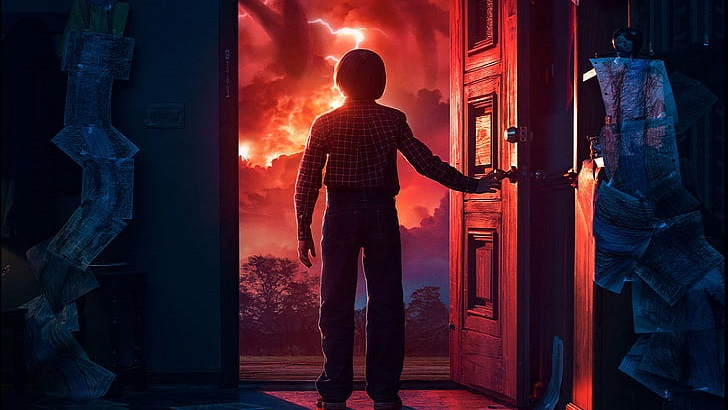
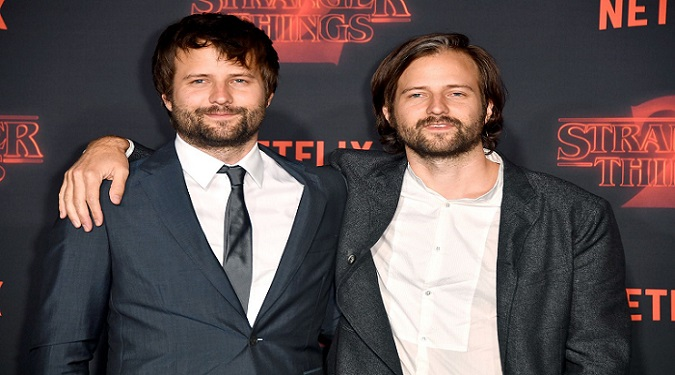

<h1>Memoria del proyecto fin de evaluación de Lenguajes de Marcas - 1º DAM/DAW</h1>
<h2>Black Mirror - A tribute site</h2>
<h2>Indice</h2>
<ul>
  <li><a href="#introduccion">Introducción</a></li>
  <li><a href="#motivacion">Motivación</a></li>
  <li><a href="#estructura">Estructura</a></li>
  <li><a href="#estilo">Estilo</a></li>
</ul>

<h2 id="introduccion">Introducción</h2>

Trabajo realizado en clase por: Juan Cid Benítez

Proyecto de web "from scratch" de 1ª evaluación de Lenguajes de Marcas

Diciembre de 2023 

Licencia CC-BY

<h2 id="motivacion">Motivación</h2>

El tema lo he elegido porque es una serie que me fascina, y además me parece un buen contenido para hacer mi primera web.

<h2 id="estructura">Estructura</h2>

La web está dividida en  6 secciones:

<ul>
  <li>Hero Section</li>  
  <li>Introducción</li>
  <li>Personajes</li>
  <li>Temporadas </li>
  <li>Produccion</li>
  <li>Footer</li>
  </ul>
  
Sin embargo tengo 4 subpáginas que están divididas cada una en 2 secciones:

  <ul>
  <li>Sinopsis</li>
  <li>Personajes</li> 
  </ul>

<h3>Hero Section</h3>

He utilizado una imagen de fondo tomada de pinterest que se adapta fácilmente a diferentes dispositivos como PC, tablets , móviles... 
Sobre ella no he colocado un Call to Action debido a que no lo encontraba portuno en mi página web y no me gustaba como quedaba 

<h3>Introducción</h3>

He puesto un texto breve sobre la introducción de stranger things, en el cual explico brevemente de lo que va.Y abajo he hecho una pequeña galería de fotos para decora y acompañar al texto de la introducción. 

<h3>Personajes</h3>

He puesto basicamente una series de cards con una imagen a la cual le das y se despliega más información, y dentro de las cards también le he añadido una foto de cada personaje.

<h3>Temporadas</h3>

Aqui básicamente lo que he hecho ha sido poner 4 subpáginas, en la que he puesto una secció de sinopsis con un video de trailer de la temporada respectiva y los personajes recurrentes.

<h3>Producción</h3>

He puesto un texto sobre la información de producción y una galería con 3 fotos en las cuales si pasas el ratón cambia de color y te sale un texto en el cual te indica el nombre de la persona de la foto.

<h3>Footer</h3>

El footer basicamente es de w3schools. 

<h2 id="estilo">Estilo de la página</h2>
<h3>Paleta de colores</h3>

Body: negro

Wrapper: negro

Textos normales: rojo

Títulos: blanco

<h3>Tipografías</h3>

Para los textos normales he puesto esta tipografía:FriendlyStranger.otf

Para los titulos he puesto esta tipografía: PaintersDisplay-DEMOONLY.otf

<h3>Imágenes</h3>

Las imagenes la he sacado de: 

Gate Matazzaro: https://www.formulatv.com/noticias/spoiler-stranger-things-4-gaten-matarazzo-empezo-116370/

Milie Boby Brown: https://www.elmundo.es/f5/mira/2019/06/03/5cf51cc221efa0f44f8b4661.html

Caleb: https://www.mycast.io/stories/stranger-things-turning-point-2019/roles/lucas-sinclair/4311402/suggestions/caleb-mclaughlin/6746192

Sadie: https://playview.blog/streaming/netflix/sadie-sink-dice-que-su-personaje-de-stranger-things-estara-en-su-fase-emo-durante-la-cuarta-temporada/

Finn: https://www.tonica.la/series/Temporada-4-de-Stanger-Things-seria-la-mas-oscura-segun-Finn-Wolfhard-20210214-0012.html

joe: https://www.gratistodo.com/fondos-de-stranger-things-wallpapers-gratis/

Natalia: https://www.magazine-hd.com/apps/wp/natalia-dyer-stranger-things-comedia/

Noah: https://www.sensacine.com.mx/noticias/noticia-18566125/

Wynona: https://www.terra.com.mx/entretenimiento/2021/1/30/revelan-el-triste-recuerdo-que-inspira-winona-ryder-en-stranger-things-11301.html

Donald de Line: https://commons.wikimedia.org/wiki/Category:Donald_De_Line

Bicicletas: https://es.atlasofwonders.com/2016/09/localizaciones-rodaje-stranger-things.html

Favicon: https://es.atlasofwonders.com/2016/09/localizaciones-rodaje-stranger-things.html

Imagen 1: https://cadenaser.com/ser/2016/12/09/television/1481290681_859925.html

Hermanos Duffer: https://elpais.com/smoda/stranger-things-netflix-maldicion-hermanos-duffer.html

Puerta: https://www.pinterest.es/pin/621848661021195841/

Ross: https://commons.wikimedia.org/wiki/File:Ross_Duffer_(36046826852).jpg

Matt: https://www.emmys.com/tags/matt-duffer

Stranger fondo: https://www.pinterest.es/pin/498773727489019204/

Sumar: https://www.freepik.es/vector-premium/simbolo-cruz-cristiana-dibujado-mano-pintado-mano-pincel-tinta_26698696.htm

<h3>Videos</h3>

De los videos básicamente lo que he hecho es poner el trailer de cada temporada.

<h2 id="snippets">Code snippets</h2>

He utilizado los siguientes:

<ul>
  <li>Barra de navegación: tomada de w3Schools "How to" (poner vínculo)</li>
  <li>Cards: tomada de w3Schools</li>
  <li>Galerías: Me he ayudado de YouTube<li>
  <li>Footer: tomada de w3Schools</li>
</ul>